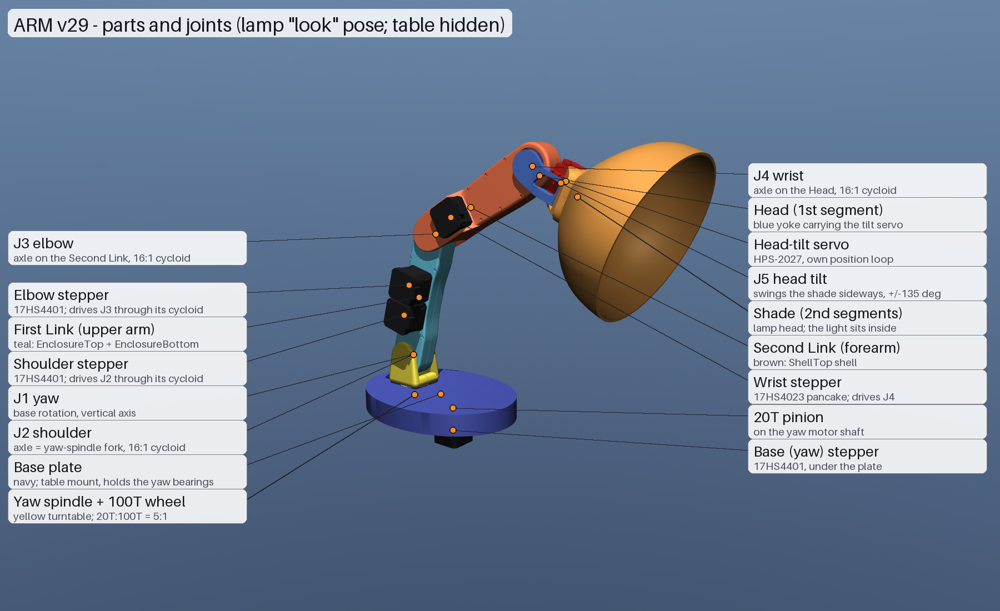
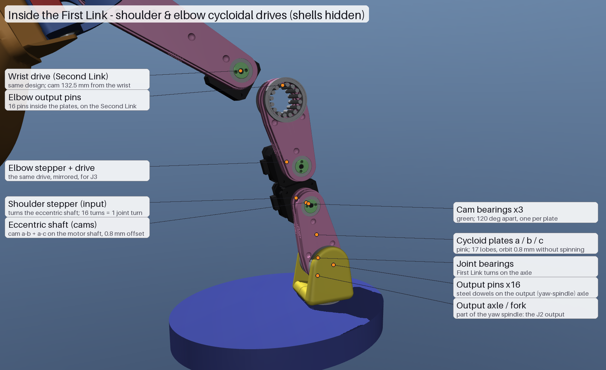

# Robot arm (ARM v29) — CAD-exact MuJoCo model

A simulation model generated from the Fusion 360 design "ARM v29" (stepper motors with cycloidal drives). Tested in MuJoCo 3.14.0.

How it relates to the rest of the repo:
- **`sim/robot.toml`:** a simplified, servo-based concept model built from capsules.
- **This folder:** the real arm, built from the CAD meshes, with masses, gearing and motors. It's the "use the CAD meshes once the arm exists" step from `motion_lib/README.md`.
- **Self-contained:** nothing outside this folder depends on it yet.

## Open it
1. Install MuJoCo, either way:
   - the **simulate** app from the [MuJoCo releases](https://github.com/google-deepmind/mujoco/releases), or
   - `pip install mujoco`, then run `python -m mujoco.viewer`.
2. Drag `robot_arm.xml` into the window. Keep the `meshes/` folder next to it.
3. In the right panel: **Control** sliders move the arm, **Key** loads the `home` / `reach` poses.

The scripts need `pip install mujoco numpy`. Rendering videos also needs `pillow` and `ffmpeg`. On macOS, run the live viewer through `mjpython` instead of `python`.

Check the model after changing anything:

```
python check_model.py       # masses, holding, couplings, plate orbit, contacts, a test move
python step_response.py     # big step commands on every joint
```

## Seeing the drives inside
- **`robot_arm_xray.xml`:** the same model with the First and Second Link shells drawn see-through, at 25% opacity. Physics are identical.
- **Hide the shells completely, in either file:** right panel → **Group enable** → untick **Geom 1**. The shells are the only parts in geom group 1.
- **Change the see-through amount:**
  - Set `XRAY_ALPHA` in `build_mjcf.py` and rebuild, or
  - Edit the last `rgba` number of `shell_first_link` / `shell_second_link` in the XML.

## Controls (actuators)
Each control is the target **arm joint angle in radians**. Each actuator's torque is limited to motor torque × gear ratio.

| Actuator | Moves | Motor | Max torque at the joint |
|---|---|---|---|
| `base_motor` | yaw | 17HS4401 + 20T:100T gear (5:1) | 2.0 N·m |
| `shoulder_motor` | shoulder | 17HS4401 + cycloid 16:1 | 6.4 N·m |
| `elbow_motor` | elbow | 17HS4401 + cycloid 16:1 | 6.4 N·m |
| `wrist_motor` | wrist | 17HS4023 + cycloid 16:1 | 2.48 N·m |
| `head_servo` | head tilt | HPS-2027 servo, ±135° | 1.96 N·m |

How the steppers are modelled:
- **Stiffness:** they hold position stiffly, at about 50 × holding torque per radian at the shaft. They saturate at holding torque, which is where a real motor would skip steps.
- **Torque drops with speed:** back-EMF, modelled as a linear fall to zero at 1500 rpm.
- **Damping:** calculated from each joint's worst-case inertia, so a saturated motor still brakes in time.
- **Setpoint smoothing:** a new command is eased in over about 0.15 s, like a driver ramping its step rate.

So even a big slider jump (1–1.5 rad) settles in about 0.6 s with no overshoot.

For good-looking motion, send smooth, speed- and acceleration-limited trajectories, as real stepper firmware does. See the lamp demo below.

## Expressive-lamp demo (`lamp_demo.py`)
It plays a choreographed show: wake up and stretch, look around, curious head tilt, peek, nod yes, shake no, a happy bounce, and back to sleep. Every move is a minimum-jerk profile limited by `VMAX` / `AMAX`, with feed-forward through the motors' smoothing and damping.

```
pip install mujoco                          # once
mjpython lamp_demo.py                       # live in the MuJoCo viewer (macOS needs mjpython)
python3 lamp_demo.py --report               # tracking error and torque use per joint
python3 lamp_demo.py --video out.mp4 --xray # render a video (needs ffmpeg)
mjpython lamp_demo.py --drive smooth        # through the simulated steppers + STM32 loop (see below)
```

Edit `POSE` and `SHOW` to choreograph your own moves.

Results with the current model:

| Joint | Tracking error | Peak torque (% of motor limit) |
|---|---|---|
| Steppers | under 0.07° | shoulder 67%, elbow 45%, wrist 46%, yaw 30% |
| Head servo | under 0.21° | 3% |

There are no collisions during the show.

## ELEGNT expressive movement (`elegnt_demo.py`)
This follows Hu et al., *ELEGNT: Expressive and Functional Movement Design for Non-anthropomorphic Robot* ([arXiv:2501.12493](https://arxiv.org/abs/2501.12493)).

The paper plans motion that maximises F + γ·E: functional utility plus γ-weighted expressive utility. Here every scenario is a script of:
- **Functional actions:** always performed.
- **Expressive actions:** amount and timing scaled by `--gamma`. γ = 0 is the paper's function-driven robot; γ = 1 is its expression-driven robot.

**Gesture vocabulary**, following the paper's categories:
- **Intention:** the head glances at a target before the body moves (`gaze_shift`).
- **Attention:** look at the user when they speak or gesture; joint attention, where the gaze follows the user's hand.
- **Attitude:**
  - nod (agree) and head shake (disagree);
  - hesitation (pauses and jerky partial starts);
  - stretching with strain when a goal is out of reach.
- **Emotion:**
  - bouncy joy, with a little yaw "tail wag";
  - sadness: a slow, lowered head;
  - relaxation: sitting down and breathing slowly;
  - fear: a sudden jerky retreat and tremble;
  - disinterest: turning away;
  - dancing in time to a beat.
- **Proxemics:**
  - approach: lean in, curious head tilt;
  - avoid;
  - gaze shifting between objects;
  - touch: pushing the cup toward the user, physically simulated.

**Scenarios:** the paper's six user-study tasks, plus a gallery of the remaining primitives.

| Scenario | Function-driven (γ = 0) | Expression-driven (γ = 1) |
|---|---|---|
| `photo` | lights the plant | looks back at the user's gesture, nods, glances at the plant, leans in curiously with a head tilt, then lights it |
| `project` | moves to the projection pose | curious lean-in toward the sketch; gaze tracks the hand (joint attention) |
| `failure` | reaches toward the shelf, reports the error | hesitates, stretches with strain at the limit, looks back at the user, shakes its head |
| `water` | points at the cup with the light on, reminds | also pushes the cup toward the user, then gazes at them before speaking |
| `social` | verbal replies only | perks up and bounces (excited), lowers its head (sad), points at the plant |
| `music` | plays music, no movement | dances on the 100 BPM beat (bounce, nod, slow sway) |
| `gallery` | still | sits and relaxes, approaches curiously, startles away, turns away bored |

The function-driven runs take 4.5–17.7 s; the expressive versions are 2–7 s longer each. All runs stay under 82% of motor torque, track within 0.35° (1° while pushing the cup), and have no collisions except the intended cup push.

The scene adds a user, with a moving hand, plus a plant, a sheet of paper, a free cup, and a spotlight inside the shade.

The look-at solver aims the shade at real points (the user's head, the cup, the plant). It keeps the wrist between −125° and +95°, so the shade never folds into the Second Link: when aiming would need more, it lowers the arm instead, and head-only glances are clamped.

```
python3  elegnt_demo.py --video elegnt.mp4          # side-by-side video (gamma 0 vs 1), all scenarios
python3  elegnt_demo.py --report                    # tracking / torque / contacts / cup push
mjpython elegnt_demo.py --scenario social --gamma 1 # live in the viewer (try --gamma 0.5)
mjpython elegnt_demo.py --scenario water --drive pid_tuned   # through the simulated steppers (see below)
```

## Stepper drivers + STM32 loop (`stepper_pid_sim.py`)
`robot_arm.xml` drives the joints with idealised position actuators. This script swaps them for the real chain on each stepper joint, so you can try firmware ideas before flashing the Arduino UNO Q:

- **Linux side:** streams targets over the Bridge at 20 Hz in whole degrees, like `apps/expressive_robot`, or sends single goal poses.
- **STM32 loop (1 kHz):** reads the four AS5600s one after another over I2C (through a TCA9548A), runs the controller and sets each motor's step rate.
- **Step timer:** a 40 kHz interrupt; at most one STEP pulse per tick per motor.
- **Driver:** 1/16 microstepping current chopper. Phase currents follow the step count until the supply voltage runs out (winding inductance + back-EMF), so torque fades with speed on its own.
- **Motor:** hybrid stepper with 50 rotor teeth, detent torque and rotor inertia. Overloaded, it really slips, 4 full steps at a time, and the script counts them.
- **Gearbox:** backlash, torsional stiffness and dry friction between the rotor and the arm joint.
- **AS5600:** 12 bit, the datasheet's slow-filter lag and noise, plus the error from an off-centre magnet. Mounted on the joint output or on the motor shaft.

The head servo keeps its own internal loop.

```
python3  stepper_pid_sim.py --report                       # every controller x sensor placement, 4 tests (~3.5 min)
python3  stepper_pid_sim.py --plot step.png                # traces like stepper_step.png (needs matplotlib)
mjpython stepper_pid_sim.py --controller pid_tuned --sensor joint --scenario push   # live viewer
python3  stepper_pid_sim.py --report --kp 20 --ki 2 --max-speed 90              # try your own PID gains
python3  tune_stepper.py                                   # re-tune after measuring (a few min, 8 cores)
```

Scenarios (`--scenario`): `step` (big target jumps), `small` (3° and 10° corrections), `boot` (power-up after the arm was moved by hand), `push` (20 N on the head for 0.5 s), `show` (the lamp demo streamed at 20 Hz).

Controllers (`--controller`):
- **`pid`:** PID on (target − measured angle), output = joint speed → step rate, with a speed limit. The usual first version. Gains are in deg/s per degree, like `robot_config.h`.
- **`pid_tuned`:** the same PID plus what a stepper needs, tuned on this model (see "Tuned settings" below):
  - a speed ramp;
  - braking in time (speed capped at √(2·accel·error));
  - an integrator that only works within 3° of the target;
  - a 0.1° deadband;
  - stall recovery.
- **`smooth`:** the MCU plans a minimum-jerk move to each new target (or smooths the 20 Hz stream) and issues exactly those steps (feed-forward). The sensor only trims the slow error (sag, backlash) through a deadband. If the error jumps past 2°, steps were lost: it re-syncs the step count and glides back.

Results with the default assumptions (12 V, driver current = rated, `stepper_step.png`, `stepper_push.png`):

| Controller, sensor | Big target jump | Power-up after being moved by hand | 20 N push on the head | Lamp show, 20 Hz stream |
|---|---|---|---|---|
| PID → step rate, joint | motors stall: 7000 steps lost, head hits the table | 26° off | 28° off | 22 000 steps lost |
| PID + speed ramp, joint | 19° overshoot, 5900 steps lost | within 0.5° | 29° off | 12 000 steps lost |
| tuned PID, joint | 0.4°, settles in 0.83 s, none lost | within 0.27° | back within 0.4° | 2.6° rms, 220 ms late, 4 steps lost |
| tuned PID, motor | 0.4°, none lost | elbow 22° off | back within 0.3° | 2.6° rms, 220 ms late |
| **Planned + feed-forward, joint** | **0.4°, no lost steps** | **within 0.26°** | **back within 0.3°** | **0.27° rms, none lost** |
| same, joint sensor calibrated | 0.1° | within 0.08° | within 0.1° | 0.21° rms, 4 steps lost (shoulder at its limit) |
| Planned + feed-forward, motor | 0.3° | elbow 22° off | back within 0.35° | 0.25° rms |
| Planned, no sensor | 0.2° | 30° off | 76° off, stays there | 0.23° rms |

What it shows:
- **The oscillation is the control law, not the sensor.**
  - A PID that turns error into step rate asks a stepper for speeds it can't reach from standstill, so it stalls and skips.
  - Add a speed ramp and it can't brake in time: it overshoots, then hunts.
  - Raising the gain makes it swing 10–20°.
- **The tuned PID fixes big moves, small corrections, power-up and pushes.**
  - It needs half the planner's speeds to stay stable, so fast streamed motion lags and gets rounded off (2.6° rms in the show).
  - The planned controller plays the same show at full speed within 0.27°.
- **With planned, feed-forward steps, the steppers do the moving.** The sensor is a supervisor:
  - It knows the pose at power-up.
  - It catches lost steps after a bump.
  - It trims sag and backlash.
- **Sensor placement:**
  - **Joint output (recommended):** absolute at power-up, and it sees everything (backlash, gearbox flex, slipping hubs, lost steps).
  - **Motor shaft:** 16× finer, but it only knows the joint angle to within one motor turn (22.5° at the cycloid joints, 72° at the yaw). After being moved while off, it ends up off by whole turns, and it never sees the gearbox.
  - **Calibration:** calibrate the joint AS5600s, since magnet misalignment (±0.4° assumed) is bigger than the sag of a stiff gearbox. One way: sweep each joint slowly with the motor (steps are accurate to ~0.01° at the joint) and store a correction table.
  - **With a PID on the sensor:** the motor shaft is the more stable place, because backlash inside a fast loop makes it hunt.
- **Torque margin:** the shoulder is the weakest joint. In the show's leaning moves it reaches 107% of its pull-out torque with the driver current at rated (A4988/DRV8825 Vref). It reaches 92% with a TMC2209 set to the rated RMS current (`--current 1.41`).

### Running the animations through the drives
`lamp_demo.py` and `elegnt_demo.py` take `--drive pid | pid_tuned | smooth`. Instead of ideal motors, the animation is streamed from "Linux" at 20 Hz in whole degrees to the simulated STM32, which drives the steppers.
- **`--sensor joint | motor | none`:** where the AS5600s are.
- **`--current` / `--vbus`:** driver current (× rated) and supply voltage.
- **Viewer overlay:** shows the drive, the sensor and lost steps per joint.
- **`--report`:** prints the error against the plan, with the stream delay removed.

| Animation | `--drive smooth` | `--drive pid_tuned` |
|---|---|---|
| lamp demo | 0.27° rms, 100 ms late, no lost steps | 2.6° rms, 220 ms late, no lost steps |
| ELEGNT, every scenario at γ 0 and 1 except failure γ 1 | within 0.5–3° (9° in the gallery's startle), about 0.1 s late, no lost steps; the cup push still moves the cup 74 mm | 2–30° behind on fast gestures (0.2 s late), no lost steps |
| ELEGNT failure, γ 1 | the shoulder can't hold the full stretch: steps lost, it drops onto the table | same |
| ELEGNT failure, γ 1, `--current 1.41` | within 3.7°, no lost steps | within 16°, no lost steps |

The failure gesture stretches the arm out horizontally and trembles. At the driver's rated current that is more than the shoulder can hold. A TMC2209 set to the rated RMS current (`--current 1.41`) handles it.

The social scenario's "point at the plant" pose sits 2 cm higher and closer than before: the original passed within 0.1 mm of the plant, so any real-world delay made the shade hit it. It now clears it by 27 mm. The project scenario's lean-in stops 2 cm shorter for the same reason. (`elegnt.mp4` was rendered before these changes.)

### Tuned settings
Found by `tune_stepper.py` on this model with the default assumptions. Starting values, not final ones: re-run the tuner once you've measured your gearbox, driver current and supply.

**Tuned PID** (`PID_TUNED` in `stepper_pid_sim.py`):
- kp 8 (deg/s per deg), ki 2, kd 0;
- deadband 0.1°;
- I-zone 3°, integrator clamp 2 deg·s;
- re-sync after a 2° stall.

| | yaw | shoulder | elbow | wrist |
|---|---|---|---|---|
| max speed (deg/s at the joint) | 86 | 58 | 72 | 86 |
| max acceleration (deg/s²) | 345 | 230 | 345 | 575 |
| microsteps per joint degree (1/16) | 44.4 | 142.2 | 142.2 | 142.2 |

The search found a broad sweet spot (kp 6–10, ki 0–2, about half the planner speeds). Higher gains or speeds bring back overshoot and lost steps.

The loop as it would run on the STM32, once per joint every 1 ms (angles in joint degrees):

```cpp
const float KP = 8, KI = 2, DEADBAND = 0.1, I_ZONE = 3, I_LIMIT = 2, RESYNC = 2;
const float MAX_SPEED[4] = {86, 58, 72, 86};          // yaw, shoulder, elbow, wrist
const float MAX_ACCEL[4] = {345, 230, 345, 575};
float integ[4], uPrev[4], cmd[4];                     // set cmd[j] = measured angle at boot

float jointSpeed(int j, float target, float measured, float dt) {   // returns deg/s
  float e = target - measured;
  e = fabsf(e) <= DEADBAND ? 0 : e - copysignf(DEADBAND, e);
  integ[j] = fabsf(e) < I_ZONE ? constrain(integ[j] + e * dt, -I_LIMIT, I_LIMIT) : 0;
  float u = KP * e + KI * integ[j];
  float vmax = fminf(MAX_SPEED[j], sqrtf(2 * MAX_ACCEL[j] * fabsf(e)));   // brake in time
  u = constrain(u, -vmax, vmax);
  u = constrain(u, uPrev[j] - MAX_ACCEL[j] * dt, uPrev[j] + MAX_ACCEL[j] * dt);   // speed ramp
  if (fabsf(cmd[j] - measured) > RESYNC) { u = 0; cmd[j] = measured; }   // stalled: stop, ramp up again
  cmd[j] += u * dt;
  uPrev[j] = u;
  return u;   // step rate = u * microsteps per joint degree, sign -> DIR pin (mind each gear's direction)
}
```

**Planned controller:** the tuner kept the defaults.
- **Planner limits:** the lamp demo's full speed (`VMAX_DEG` / `AMAX_DEG`).
- **Trim:** 4 /s through a 0.1° deadband, re-sync at 2°.
- **Stream:** 6 Hz smoothing, capped at the same speed and acceleration limits.
- **Shoulder margin:** slowing the planner does not buy back the shoulder's margin in the show. The peak comes from the shoulder carrying gravity while the elbow and wrist brake, plus clunks through the gearbox backlash. So the fix is hardware: more driver current (TMC2209) or less backlash.

**Mounting, from the CAD:** each cycloid sits 70.5 mm (wrist: 132.5 mm) along the link from its joint. The joint axis is a solid axle belonging to the next link (the yaw spindle's fork at the shoulder, Second Link at the elbow, Head at the wrist).
- **Joint sensor:** press a 6 × 2.5 mm diametric magnet into the centre of the axle end. Put the AS5600 on a small printed cap on the motor-side link, reaching over the outside of the fork, 1–2 mm from the magnet.
- **Motor-side sensor:** the 17HS4401s stick out of First Link, so their back faces are free if your motors have a rear shaft stub.
- **Yaw:** the easiest joint. Put the magnet in the bottom face of the yaw spindle and the sensor on the motor bracket under the base plate.
- **I2C:** all AS5600s share address 0x36. Use a TCA9548A multiplexer, AS5600L parts (programmable address), or their analog outputs.

Assumptions to replace with measurements (CONFIG block at the top of the script):
- **Gearbox:** backlash 0.3° (cycloids) / 0.2° (yaw); stiffness 1000 N·m/rad (shoulder, elbow), 500 (wrist), 2000 (yaw); friction 0.08–0.15 N·m. These are guesses. To measure: lock a motor, hang a known weight on the link and read the joint AS5600.
- **17HS4023:** resistance, inductance and rotor inertia are typical values, not from its datasheet.
- **Links:** rigid; their flex would add to the gearbox compliance.
- **Driver and supply:** 12 V, current set to the motors' rated current (A4988/DRV8825 style). Change with `--vbus` / `--current`, then re-run `tune_stepper.py`.
- **Your firmware:** the plain PID rows are a generic version (kp 15, ki 5, 120°/s limit from `robot_config.h`). Set yours with `--kp --ki --kd --max-speed --max-accel`.

## Parts and terminology



Regenerate both pictures with `python3 label_parts.py`.

### The arm, from the table up
It has 5 joints (degrees of freedom): four driven by steppers, one by a servo. "Proximal" means closer to the base, "distal" further out. Each joint connects a parent link (before it) to a child link (after it).

| Part | Also called | What it is on ARM v29 |
|---|---|---|
| Base plate | base, mount | Navy plate fixed to the table. Holds the yaw bearings; the yaw stepper hangs underneath. |
| Yaw spindle | turntable, waist | Yellow part that turns on the base. Its bottom carries the 100T wheel; its top is the fork (clevis) holding the shoulder axle. |
| **J1 yaw** | base rotation, waist joint | Vertical axis. Driven through a 20T pinion → 100T wheel spur-gear pair (5:1). |
| **J2 shoulder** | shoulder pitch | First Link pitches on an axle that belongs to the yaw-spindle fork. 16:1 cycloid. |
| First Link | upper arm, link 1 | Teal shell (EnclosureTop + EnclosureBottom). Carries the shoulder and elbow steppers and both of their cycloid drives. |
| **J3 elbow** | elbow pitch | Second Link pitches on its own axle, which runs through the First Link's bearings. 16:1 cycloid. |
| Second Link | forearm, link 2 | Brown shell (ShellTop). Carries the wrist stepper and the wrist cycloid. |
| **J4 wrist** | wrist pitch | Head pitches on its axle at the end of the Second Link. 16:1 cycloid. |
| Head | wrist yoke, 1st segment | Blue bracket carrying the head-tilt servo. |
| **J5 head tilt** | head roll / side tilt | HPS-2027 servo swings the shade sideways, ±135°. |
| Shade | end effector, lamp head, 2nd segments | Orange lamp head; the light sits inside. |

### Drive train
| Term | Meaning here |
|---|---|
| Stepper motor | Moves in fixed steps (200 per turn). 17HS4401 for yaw, shoulder and elbow; 17HS4023 "pancake" for the wrist. |
| Microstepping | The driver splits each step, e.g. 1/16 = 3200 microsteps per motor turn. |
| Holding / pull-out torque | The most torque the motor can hold still / while moving. Past pull-out it **loses steps** (slips 4 full steps at a time). |
| Driver | Board that turns STEP/DIR pulses into coil currents (A4988, DRV8825, TMC2209). |
| Pinion / wheel | The small (20T) and large (100T) gears of the yaw drive. 20T:100T = **5:1 reduction**. |
| Reduction ratio | Motor turns per joint turn. More torque and resolution at the joint, less speed. |
| Cycloidal reducer (inside-out) | The 16:1 gearbox in each arm joint, built from the parts below. |
| Input / eccentric shaft | The motor shaft with the offset cams (cam a-b, cam a-c), 0.8 mm **eccentricity**. |
| Cam bearings | Three bearings on the cams, 120° apart, each driving one plate. |
| Cycloid plates (discs) | The long pink plates a, b, c. One end rides on a cam bearing; the other end is a ring with 17 internal lobes around the pins. They orbit 0.8 mm without spinning, a third of a turn out of phase so the drive never locks up. |
| Output pins | 16 steel dowels on the child link's axle. The lobes roll around them, turning the joint 1/16 of a turn per motor turn. |
| Output axle / clevis | The child link's axle (a fork at the shoulder), supported by the parent link's bearings. |
| Backlash | Free play in a gearbox (≈0.3° assumed for the printed cycloids). |
| Torsional stiffness | How much a gearbox twists under load (N·m per radian). |

### Sensing and control
| Term | Meaning here |
|---|---|
| AS5600 | 12-bit magnetic angle sensor reading a diametric magnet on a shaft end. |
| Joint-side vs motor-side sensor | On the joint output (absolute angle, sees backlash and flex) or on the motor shaft (16× finer, but only knows the angle within one motor turn). |
| TCA9548A | I2C multiplexer: lets several AS5600s share one bus despite their fixed address. |
| PID | Control law: speed = kp·error + ki·∫error + kd·d(error)/dt. |
| Feed-forward | Sending the planned motion directly as steps instead of waiting for an error. |
| Trim / re-sync | Slow sensor correction of small errors / recounting steps after lost steps. |
| Servo (HPS-2027) | Motor with a built-in position sensor and controller; takes an angle command. |

## What is modelled
- **Geometry:** every part exported from Fusion at the home pose, in its exact assembly position. Home is all joints 0, with the arm pointing straight up.
- **Front:** the lamp's front is the base plate's long side (the yaw-motor end, Fusion −X), and positive shoulder, elbow and wrist angles bend toward it. The parts are exactly as in Fusion: the arm just bends the other way round its output axles. The whole robot is placed turned 180° in the world so this front is world +X.
- **Joints:** yaw, shoulder, elbow, wrist and head tilt, plus each motor shaft.
- **Cycloidal drives:** each eccentric shaft (cams + cam bearings) spins on its motor axis. The 3 cam plates ride on their cam bearings and orbit 0.8 mm without spinning, 120° apart. The 16 pins are fixed to the output link.
- **Couplings:** exact, as joint equality constraints:
  - Shoulder: motor shaft = −16 × shoulder.
  - Elbow: motor shaft = 16 × elbow.
  - Wrist: motor shaft = 16 × wrist.
  - Base: pinion = −5 × yaw.
  - Each cam plate = −(its motor shaft), so it doesn't spin.
- **Rotor inertia and actuator torque:** applied at the arm joints, multiplied by the gear ratio (rotor inertia and damping × ratio²). This is mechanically equivalent to driving the motor shaft, and numerically much more robust. The motor shafts, cams and plates still turn exactly, through the couplings.
- **Mass and inertia:** computed by MuJoCo from the meshes, within 0.1% of Fusion's volumes.

## Assumptions (edit the CONFIG block in `build_mjcf.py`, then run `python3 build_mjcf.py`)
- **PLA parts:** 15–20% infill, simulated at 55% of solid PLA (0.68 g/cm³).
- **Steel:** bearings, cam bearings and the cycloid pins (assumed steel dowels).
- **Bought parts:** masses are datasheet values spread over the part's volume. 17HS4401 280 g, 17HS4023 140 g, HPS-2027 66 g.
- **Head 2nd-segment Body8 / Body10:** these are surface bodies in Fusion (no thickness), so they're visual only and massless.
- **Collisions:**
  - Convex hulls of the link shells, motors, servo housing and base plate.
  - Drive internals, pins, bearings and gears are visual only.
  - The yaw spindle and 100T wheel sit below the base plate (through the table), so they don't collide with the table.
- **Table:** at the underside of the base plate.
- **Front / bending direction:** `FRONT_IS_LONG_SIDE = True` in `build_mjcf.py` (see "Front" above). `False` gives the Fusion export's convention (bending toward Fusion +X, over the plate's short side).
  - Bending this way mirrors how far the head folds toward the forearm. The wrist is free from −130° to +100° (it used to be −100° to +130°), so the ELEGNT look-at solver now bends the arm more rather than fold the shade past +95°.
  - `preview.png`, `preview_drives.png` and the videos were rendered before this change.
- **Joint limits:** none on yaw, shoulder, elbow or wrist; the links' collisions stop them. Head tilt is ±135° (the servo's 270°).
- **Not modelled in `robot_arm.xml`:** cycloid/gear friction, backlash, efficiency, and stepper resonance or missed steps. `stepper_pid_sim.py` adds backlash, gearbox stiffness, friction and real stepper behaviour on top.

## Files
- `robot_arm.xml`: the model (scene, robot, actuators, sensors, keyframes).
- `robot_arm_xray.xml`: the same model with see-through link shells.
- `lamp_demo.py`: expressive-lamp motion demo (viewer, report or video).
- `lamp_demo.mp4`, `lamp_demo_xray.mp4`: the demo, rendered.
- `elegnt_demo.py`: ELEGNT expressive/functional scenarios (video, report or viewer).
- `elegnt.mp4`: the seven scenarios side by side, function-driven vs expression-driven.
- `meshes/`: STL parts from Fusion (mm, scaled in the XML).
- `build_mjcf.py`: regenerates `robot_arm.xml` from `fusion_export.json`.
- `fusion_export.json`: part transforms, volumes and joint pivots read from Fusion.
- `expected_masses.json`: body masses predicted from the Fusion volumes (for checking).
- `check_model.py`, `step_response.py`: model checks (see "Open it").
- `stepper_pid_sim.py`: stepper drivers, AS5600s and the STM32 loop on the CAD model (report, plots or viewer).
- `tune_stepper.py`: grid-searches the PID and planner settings in `stepper_pid_sim.py`.
- `label_parts.py`, `arm_parts.png`, `drive_parts.png`: the labelled pictures in "Parts and terminology".
- `stepper_step.png`, `stepper_push.png`: its big-step and push traces for every controller and sensor placement.
- `preview.png`, `preview_drives.png`: renders of the model.
